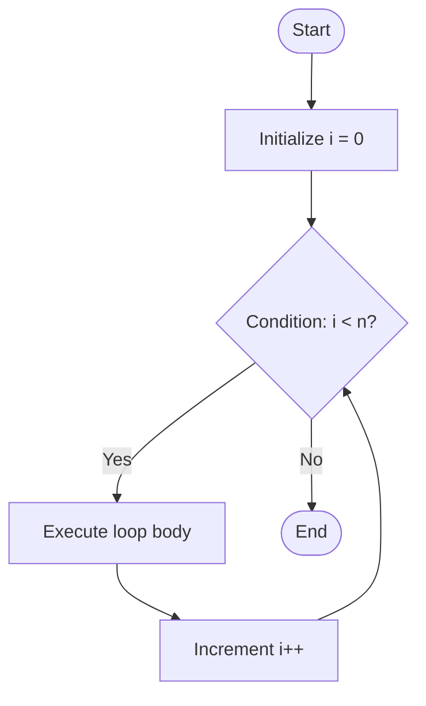
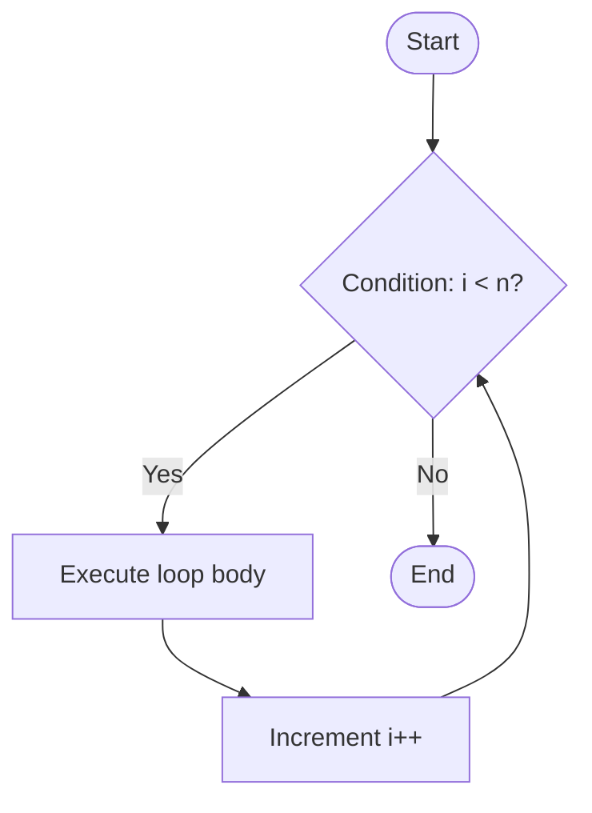
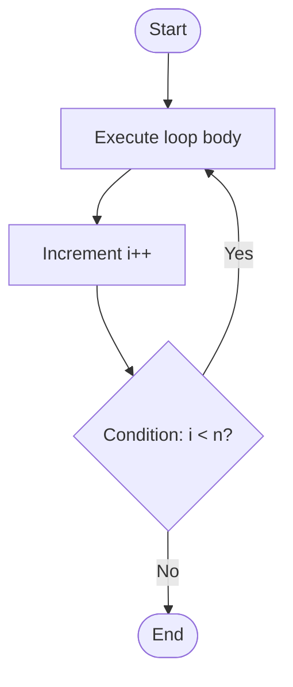

# 🌀 Loops in C Programming

Loops in C are used to **repeat a block of code multiple times**.  
They help reduce code repetition and automate tasks.

---

## 🧩 1. Types of Loops

| Loop Type | Description |
|-----------|-------------|
| `for`     | Used when the **number of iterations is known** |
| `while`   | Used when the loop should continue **while a condition is true** |
| `do...while` | Executes the loop **at least once**, then checks the condition |

---

## 🔁 2. `for` Loop

### Syntax
```c
for(initialization; condition; increment) {
    // code to execute
}
``` 

# 🌀 Flowcharts for C Loops

## 🔁 1. `for` Loop Flowchart


## 🔁 2. `while` Loop Flowchart


## 🔁 3. `do...while` Loop Flowchart
