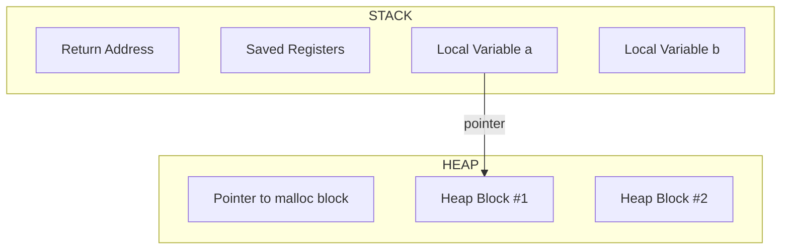

---

# 🧠 **Stack និង Heap ជាអ្វី? (Detailed Explanation)**

ក្នុងកម្មវិធី C (និងភាសាច្រើនទៀត) ពេលកម្មវិធីរត់ វាត្រូវការកន្លែងក្នុង memory ដើម្បីរក្សាទុកទិន្នន័យ។
Memory ត្រូវបានបែងចែកជាផ្នែកចម្បង 2៖

---

# 1️⃣ **Stack**

### 📌 **Stack គឺជា memory ដែលរដ្ឋបាលដោយ system (automatic memory)**

* ប្រើសម្រាប់ **local variables** ក្នុង function
* ប្រើសម្រាប់ **function call, return address**
* Memory ត្រូវកំណត់ជាមុន → **ទំហំតូចជាង heap**
* Variable នៅក្នុង stack នឹងបាត់បង់ភ្លាមៗ ពេល function បញ្ចប់

### ✔ លក្ខណៈ

* Allocation / Deallocation → **very fast**
* managed automatically
* សុវត្ថិភាពខ្ពស់ ព្រោះ compiler កាន់គ្រប់
* មិនអាចរក្សាទុកទិន្នន័យធំៗយូរៗបាន
* បើការហៅ function ជាច្រើន → **stack overflow**

---

# 2️⃣ **Heap**

### 📌 **Heap គឺជា memory ដែលអ្នកសរសេរកូដត្រូវរដ្ឋបាលដោយខ្លួនឯង (manual memory)**

* ប្រើសម្រាប់ data ដែលត្រូវរស់បានយូរ
* អ្នកត្រូវប្រើ **malloc(), calloc(), realloc(), free()**

### ✔ លក្ខណៈ

* Allocation / Free → **slower**
* អាចរក្សាទុក data ធំៗ
* ត្រូវ free មិន然 → memory leak
* Flexible ដាច់ខាត

---

# 🧪 **C Examples for Stack vs Heap**

---

## **Example 1: Stack variable**

```c
#include <stdio.h>

void show() {
    int a = 10;   // stored in stack
    printf("a = %d\n", a);
} // 'a' is destroyed here automatically

int main() {
    show();
    return 0;
}
```

📌 នៅពេល function `show()` បញ្ចប់
→ variable `a` ត្រូវលុបចេញពី stack ភ្លាមៗ

---

## **Example 2: Heap variable**

```c
#include <stdio.h>
#include <stdlib.h>

int main() {
    int *p = malloc(sizeof(int));  // memory on heap
    *p = 20;

    printf("p = %d\n", *p);

    free(p); // must free manually (important)
    return 0;
}
```

📌 memory ដែល malloc បង្កើត **នៅតែរស់** រហូតដល់អ្នក free()
មិន free() → memory leak

---

# ⚔️ **Stack vs Heap (Full Comparison Table)**

| Feature          | Stack                       | Heap                                |
| ---------------- | --------------------------- | ----------------------------------- |
| Memory type      | Automatic                   | Manual                              |
| Allocation speed | Very fast                   | Slower                              |
| Created by       | System                      | Programmer (malloc/free)            |
| Lifetime         | Function-level              | Until free()                        |
| Size limit       | Small                       | Very large                          |
| Fragmentation    | No                          | Yes                                 |
| Risk             | Stack overflow              | Memory leak, dangling pointer       |
| Typical use      | Local variables, small data | Large data, dynamic arrays, structs |

---

# 🚀 **Example Comparing Stack and Heap in One Program**

```c
#include <stdio.h>
#include <stdlib.h>

void test() {
    int x = 5;          // stack
    int *y = malloc(sizeof(int)); // heap
    *y = 50;

    printf("x = %d\n", x);   // x disappears after function end
    printf("y = %d\n", *y);  // y lives until free()

    free(y);
}

int main() {
    test();
    return 0;
}
```

---

# 📝 **Explained in Khmer (Detailed Khmer Explanation)**

### 🟦 Stack

Stack គឺ memory ដែល OS គ្រប់គ្រងដោយស្វ័យប្រវត្តិ។
វាអាចប្រើសម្រាប់ local variable, function call, parameter។

* ពេលចូល function → memory ត្រូវបង្កើត
* ពេលចេញ function → memory ត្រូវលុប
  → ដំណើរការពិតជារហ័ស!

Stack មានទំហំតូច ដូច្នេះ data ធំៗ (array ធំ 1000000+) មិនអាចដាក់បាន។

---

### 🟩 Heap

Heap មិនជាប់ជាមួយ function ណាមួយទេ។
អ្នក programmer ត្រូវស្នើ memory ដោយខ្លួនឯង (malloc)
ហើយត្រូវលុប (free) ដោយខ្លួនឯងផងដែរ។

→ ល្អសម្រាប់ data ធំៗ
→ ល្អសម្រាប់ data ដែលចង់រក្សាទុកបានយូរ

តែពិបាកគ្រប់គ្រងជាង Stack។

---

# 🧠 សរុបខ្លីៗ (Easy Summary)

* **Stack = សម្រាប់ local data, ស្វ័យប្រវត្តិ, លឿន, តូច**
* **Heap = សម្រាប់ dynamic data, ត្រូវ malloc/free, ធំ, បត់បែនបាន**

---
