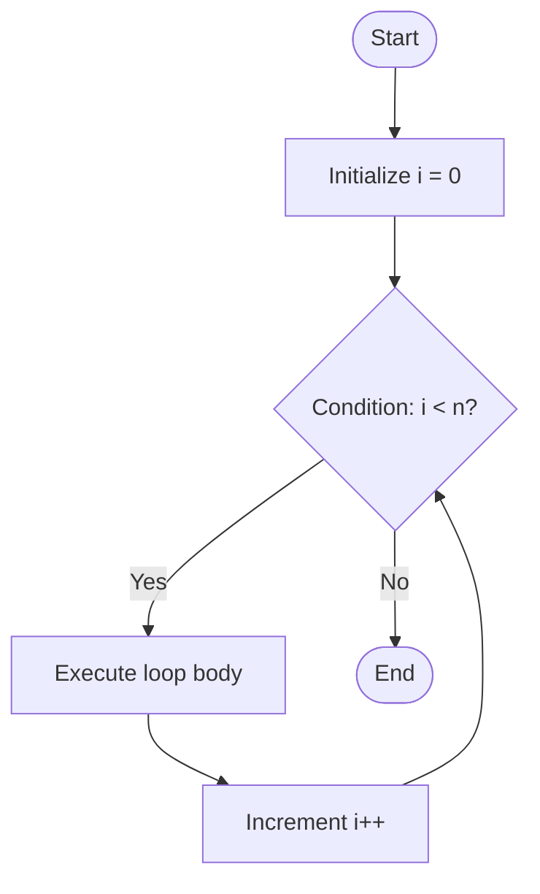

# 🧭 Control Flow in C Programming

Control flow statements in C determine **the order in which instructions are executed**.  
They let the program make decisions, repeat actions, or jump to different parts of the code.

---

## 🧩 Types of Control Flow

| Type | Keywords | Description |
|------|-----------|-------------|
| **Decision Making** | `if`, `else if`, `else`, `switch` | Execute code based on conditions |
| **Looping (Iteration)** | `for`, `while`, `do...while` | Repeat a block of code multiple times |
| **Jump Statements** | `break`, `continue`, `goto`, `return` | Change control flow direction |

---

## ⚙️ Decision Making Statements

### `if` Statement
```c
if (condition) {
    // Executes if condition is true
}




